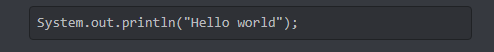
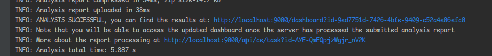
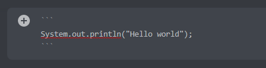

# SonarQuBot

## How to run

### SonarQube Server

1. Start Sonarqube container from Docker. Run this command in your terminal:

> docker run -d --name sonarqube -e SONAR_ES_BOOTSTRAP_CHECKS_DISABLE=true -p 9000:9000 sonarqube:latest

2. Wait until the server has started inside Docker. You can retry step 3 until it works or check the container logs.

3. Go to `http://localhost:9000` and login. Default username/password is `admin/admin`.

4. You will be asked to change password. Do it!

### Add your secrets

1. Create a file named `secret.properties` in `src/main/resources`. The following secrets are required to run the
   application.

> discord.bot.token=yourToken
>
> sonar.user=admin
>
> sonar.password=yourNewPassword

## How to use

1. Run application.
2. Make sure bot is online in the Discord-server.
3. Write a message with a code block. The message must contain only a code block.
   
4. Check application log to see result (the bot doesn't answer properly yet)
   
5. Click the link to see the result.

### FAQ

#### How to write a code block?

Use three backticks to open and close the block:

#### Which programming language can I scan?

SonarQube supports many languages, but the bot only supports Java at this moment.

#### Which errors can the bot find in my code?

[Here is a list!](https://rules.sonarsource.com/java/type/Code%20Smell/)

#### Why did the bot not analyze my code?

Make sure your entire message must be contained in a code block.
If the bot still couldn't analyze your code it will notify you.

#### It still doesn't work!

The application has some bugs and can crash. If you cannot get the application to work, remove the Sonarqube container
and start over from `How to run`.

You can report [issues](https://github.com/DoNotWorr/sonarqube-discord-bot/issues) or make
a [pull request](https://github.com/DoNotWorr/sonarqube-discord-bot/pulls) if you want to fix something. 
